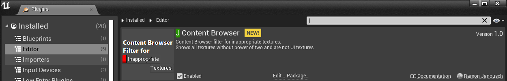
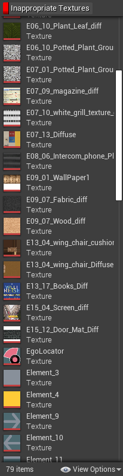
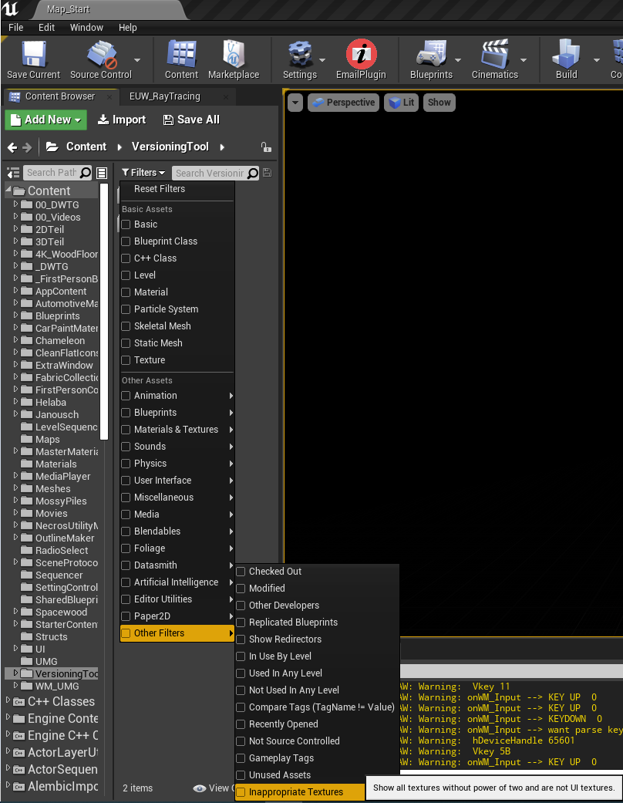
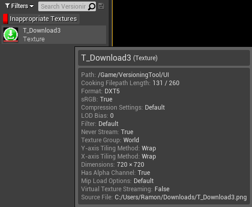

# JContentFilter

## About

This plugin adds a filter to the content browser so that it shows inappropiate textures.
Unreal Engine 4 Content Filter for inappropiate textures. The filter will list all textures without a power of two and not marked as UI textures.

     
     

## [How It Works](https://youtu.be/JsO7D6tR1l4)

1. Clone the repository into your projects Plugins folder under /JContentFilter. Make sure the version matches the Unreal version of your project.
  (Optional if the correct UE4 version is missing)
      1.2 Clone from the master branch or delete the Binaries and Intermediate folder in /JContentFilter
      1.3 Generate visual studio project files
      1.4 Compile the solution
2. Open your project select the filter in the Content Browser: Filters -> Other Filters -> Inappropiate Textures

## Usage

* Use it to find textures in your project where you can't use mip mapping
* Use it to find textures in your project where you forgot to mark them as UI textures
* Use it to create your own Content Filter Plugin

                
                

           

### More Information
https://docs.unrealengine.com/en-US/Engine/Content/Types/Textures/Importing/index.html

## How to Contribute

1. Clone repo and create a new branch
2. Make changes and test
3. Submit Pull Request with comprehensive description of changes

## Donations

This is free, open-source project. If you'd like to support the development of future projects, or say thanks for this one, you can donate BTC at `18zzhkgheRhxHCUbydeE9Dco8mJeEKfXrY`.

## License

The JContentFilter is licensed under the terms of the MIT
license and is available for free.
